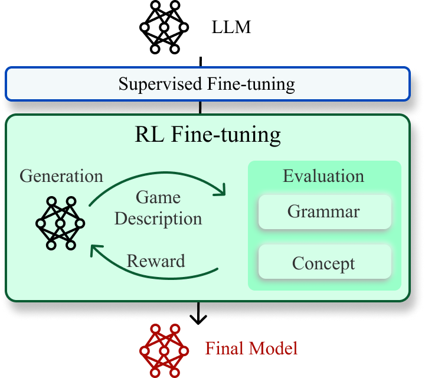
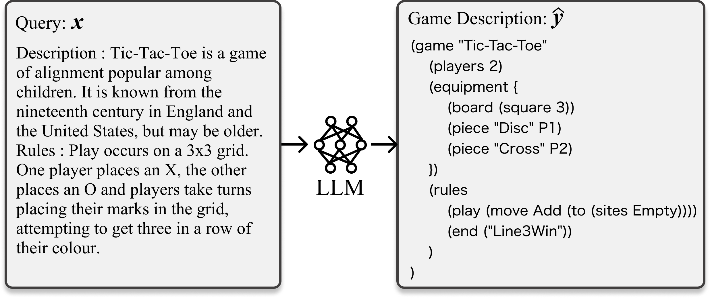

<div align="center">
<h1> Grammar and Gameplay-aligned RL for Game Description Generation with LLMs </h3>

<h5 align="center">
    <a href="https://tsunehiko.github.io/">Tsunehiko Tanaka</a><sup>1</sup>&emsp;
    <a href="https://esslab.jp/~ess/ja/">Edgar Simo-Serra</a><sup>1</sup>&emsp;
    <br>
    <sup>1</sup>Waseda University
</h5>

<h3 align="center">
Conference on Games, 2025
</h3>


[](https://arxiv.org/abs/2503.15783)

<table>
  <tr>
    <td></td>
    <td></td>
  </tr>
</table>
</div>


This paper presents reinforcement learning fine-tuning of LLMs using [GRPO](https://arxiv.org/abs/2402.03300) for game description generation.


## Prerequisites

| Software      |
|-------------- |
| Python >=3.11 |
| Docker        |
| CUDA          |
| uv            |

## Installation
1. Build a Docker image
```shell
./docker/build.sh
```

2. Attach a container to your shell
```shell
./docker/run.sh
./docker/exec.sh
```

3. Install the dependency packages using uv
```shell
GIT_LFS_SKIP_SMUDGE=1 uv sync --no-group dev --no-group flash-attn
uv sync --group flash-attn --no-build-isolation
```

4. Download the Ludii library:
```shell
mkdir ludii_java/libs
wget -P ludii_java/libs https://ludii.games/downloads/Ludii-1.3.14.jar
```

5. Compile Java programs
```shell
javac -cp ludii_java/libs/Ludii-1.3.14.jar:ludii_java/src \
      -d ludii_java/out \
      ludii_java/src/EvalLudiiGame.java \
      ludii_java/src/ComputeConcept.java \
      ludii_java/src/ComputeMultiAgents.java \
      ludii_java/src/ExtractExpand.java

mkdir -p ./ludii_java/jars/
jar cfm ./ludii_java/jars/EvalLudiiGame.jar ./ludii_java/manifest_eval.mf -C ludii_java/out .
jar cfm ./ludii_java/jars/ComputeConcept.jar ./ludii_java/manifest_concept.mf -C ludii_java/out .
jar cfm ./ludii_java/jars/ComputeMultiAgents.jar ./ludii_java/manifest_ma.mf -C ludii_java/out .
jar cfm ./ludii_java/jars/ExtractExpand.jar ./ludii_java/manifest_expand.mf -C ludii_java/out .
```

## Data Preprocessing
1. Expand game-specific functions in game descriptions:
```shell
java -jar ludii_java/jars/ExtractExpand.jar
```

2. Create a list of expanded games:
```shell
uv run src/data_processing/generate_gamelist.py
```

3. Calculate the concept values for all games. This processing takes a very long time. Please adjust `num_processes` and `num_threads` according to your CPU resources.
```shell
uv run src/data_processing/generate_concept.py --num_processes 12 --num_threads 50
```

4. Creates a list of games used for evaluation:
```shell
uv run src/data_processing/generate_eval_set.py
```

5. Build training data for GRPO and SFT:
```shell
uv run src/data_processing/generate_grpo_train_set.py
uv run src/data_processing/generate_sft_train_set.py --train_gamelist_path data/ludii/grpo/gamelist.txt
```

## Training models
1. Execute SFT:
```shell
uv run accelerate launch --config_file recipes/accelerate_configs/ddp.yaml src/rlgdg/sft.py --config recipes/ludii/sft/config_sft.yaml
```

2. Apply GRPO to the SFT fine-tuned model:
```shell
ACCELERATE_LOG_LEVEL=info uv run accelerate launch --config_file recipes/accelerate_configs/zero2.yaml --num_processes=1 src/rlgdg/grpo.py     --config recipes/ludii/grpo/config_grpo.yaml
```

## Evaluation
```shell
./scripts/standard.sh
uv run src/ggdg/evaluate.py log/gdg/Qwen2.5-1.5B-Instruct_SFT_GRPO/0
```

## Acknowledgements
This repository is based on [ggdg](https://github.com/Tsunehiko/ggdg) and [open-r1](https://github.com/huggingface/open-r1).

## Citation
```bibtex
@InProceedings{TanakaCOG2025,
   author    = {Tsunehiko Tanaka and Edgar Simo-Serra},
   title     = {{Grammar and Gameplay-aligned RL for Game Description Generation with LLMs}},
   booktitle = "Proceedings of the Conference on Games (CoG)",
   year      = 2025,
}
```
